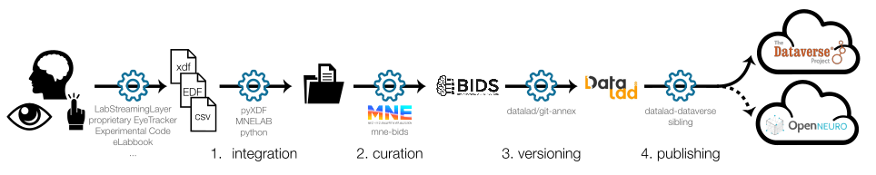

# Tutorial 
## Getting Started with LSLAutoBIDS



This tutorial will guide you through the steps to set up and use the LSLAutoBIDS package for converting EEG recordings to BIDS format, version controlling the data with Datalad, and uploading it to a Dataverse repository with a practical example.

### Installation and Download
1. Clone the GitHub Repository
```
git clone https://github.com/s-ccs/LSLAutoBIDS.git
```
2. Pip install the package
```
    cd LSLAutoBIDS
    pip install .
```
  `git-annex` is required but not a Python package. You need to install it separately after installing the requirements, either with your system’s package manager or simply by running:
```
datalad-installer git-annex
```

3. Download the dummy dataset for testing in the LSLAutoBIDS root directory - ([tutorial_sample_dataset](https://files.de-1.osf.io/v1/resources/wz7g9/providers/osfstorage/68c3c636e33eca3b0feffa2c/?zip=))

The dataset has a sample project called "test-project" which contains an EEG recording file in the projects directory, a sample eyetracking recording in the `project_stimulus/data` directory, and a dummy experimental code file in the `project_stimulus/experiment` directory.
```
sample_data
└── project_stimulus 
  └── test-project
    ├── data
      └── sub-999
        └── ses-001
          └── beh
            └── behavioral_files((lab notebook, CSV, EDF file, etc))            
    ├── experiment
      └── experimental_files (Matlab code, opensesame files, etc)
└── projects
  └── test-project
    └── sub-999
      └── ses-001
        └── eeg
          └── xdf file
```

### Configuration
1. Generate the global configuration file
```
lslautobids gen-dv-config
```
This will create a configuration file template in folder `~/.config/lslautobids/`. This will create a config file with the dataverse details and the root directories for the projects.

2. Create a Dataverse account and get the API token
- Create a Dataverse account in your institution's Dataverse server (e.g., https://darus.uni-stuttgart.de/dataverse/darus)
- Create a new dataverse for your project
- Create a new API token from your Dataverse account settings page (http://guides.dataverse.org/en/latest/user/index.html).

3. Open the configuration file `~/.config/lslautobids/autobids_config.yaml` and fill in the details
- Edit the file, e.g., via `nano ~/.config/lslautobids/autobids_config.yaml` to add the dataverse and project root details.

Configuration file template:
```yaml
    "BIDS_ROOT": "# relative to home/users directory: LSLAutoBIDS/sample_data/bids/",       
    "PROJECT_ROOT" : "# relative to home/users: LSLAutoBIDS/sample_data/projects/", 
    "PROJECT_STIM_ROOT" : "# path relative to home/users: LSLAutoBIDS/sample_data/project_stimulus/", 
    "BASE_URL": "https://darus.uni-stuttgart.de",  # The base URL for the service.
    "API_KEY": "# Paste your dataverse API token here", # Your API token for authentication.
    "PARENT_DATAVERSE_NAME": "simtech_pn7_computational_cognitive_science" # The name of the dataverse to which datasets will be uploaded. When you in the dataverses page , you can see this name in the URL after 'dataverse/'.
```
***This will be mostly same for all the projects, thus running this command is only recommended once per system.***

4. Create a project-specific configuration file
This will create a project-specific configuration file template in the specified project root directory.

```
lslautobids gen-proj-config --project test-project
```

This will create a test-project_config.toml file in the project root directory. 

> [!NOTE]: _For the rest of the tutorial, we are assuming that we place the downloaded sample_data in the root of the cloned LSLAutoBIDS repository and `LSLAutoBIDS` is cloned in the `home/users/` folder. In this case, the projects root will be `LSLAutoBIDS/sample_data/projects/` and so on for project_stimulus and bids._


Fill in the details in the configuration file `LSLAutoBIDS/sample_data/projects/test-project/test-project_config.toml` file.

You can find the details about the parameters in the comments of the template configuration file generated. For this tutorial, you might want to just change the author and email fields. Rest of the fields are already filled in for the test project.

## Example Case 1

A lab wants to conduct an EEG-EyeTracking experiment and wants to make this dataset publicly available for the other neuroscience researchers. To assure data provenance and reproducibility within and across labs, they want to have a standardized structure for storing the data and code files. 

In this example, we will see how to use the LSLAutoBIDS package to:
1. Convert the recorded EEG data in `xdf` format to BIDS format.
2. Integrate other data files (e.g. eye-tracking recording, experiment code files) into the dataset (Note: LSLAutoBIDS does not do any conversion of these files into BIDS format, it just copies these files to the appropriate directories in the BIDS dataset in a psuedo-BIDS like structure).
3. Version control the data and code files using Datalad.
4. Upload the dataset to a Dataverse repository for public access.

### How to run the example?

1. Check if the toml configuration file `LSLAutoBIDS/data/projects/TestProject2025/TestProject2025_config.toml` is filled in with the correct details, specially the stimulusFilesUsed and expectedFiles fields. For this example we are using eye tracking data as a behavioral file, thus the stimulusFilesUsed field should be set to true and the expectedFiles field should contain the expected stimulus file extensions.
1. Check if the toml configuration file `LSLAutoBIDS/sample_data/projects/test-project/test-project_config.toml` is filled in with the correct details, specially the stimulusComputerUsed and expectedFiles fields. For this example, we are using eye tracking data as a behavioral file, thus the stimulusComputerUsed field should be set to true and the expectedFiles field should contain the expected stimulus file extensions.
```toml
  [StimulusFilesInfo]
    stimulusFilesUsed = true

  [StimulusFilesInfo]
    expectedStimFiles = [".edf", ".csv", "_labnotebook.tsv", "_participantform.tsv"]
```
2. Run the conversion and upload command to convert the `xdf` files to BIDS format and upload the data to the dataverse.
```
lslautobids run -p test-project
```

  1. This will convert the xdf file in the `LSLAutoBIDS/sample_data/projects/test-project/sub-999/ses-001/eeg/` directory to BIDS format and store it in the `LSLAutoBIDS/sample_data/bids/test-project/sub-999/ses-001/` directory. 
  2. You can check the logs in the log file `LSLAutoBIDS/sample_data/bids/test-project/code/test-project.log` file. 
  3. The source data i.e., the raw `xdf` file, behavioral data (e.g. eye-tracking recording) and the experimental code files in `PROJECT_STIM_ROOT/test-project/experiment` (all files e.g., `.py`, `.oxexp` will be compressed to a `tar.gz` archive) will be copied to the `LSLAutoBIDS/sample_data/bids/test-project/source_data/`, `LSLAutoBIDS/sample_data/bids/test-project/beh/` and `LSLAutoBIDS/sample_data/bids/test-project/misc/` directories respectively.

## Example Case 2
In this case, the experimenter wants to publish **only the raw EEG recordings and the converted EEG files**, but wants to **exclude the stimulus files and experiment code**.

### How to run the example?
1. The workflow is almost identical to Example Case 1, except **stimulus and experiment files are excluded**.
2. Check if the toml configuration file `LSLAutoBIDS/sample_data/projects/test-project/test-project_config.toml` is filled in with the correct details.

```toml
  [Computers]
    stimulusComputerUsed = False
```
3. Run the conversion and upload command to convert the `xdf` files to BIDS format and upload the data to the dataverse.
```
lslautobids run -p test-project
```
  1. This will convert the `xdf` file, and you can check the logs in the log file as shown in example case 1.
  2. `LSLAutoBIDS/sample_data/bids/test-project/beh` and `LSLAutoBIDS/sample_data/bids/test-project/misc` directories do not exist in the **converted bids**. 


## After publishing the dataset (Out of Scope of this package)

Once the dataset is published in Dataverse, other researchers can access the dataset and also cite the dataset using the DOI provided by that Dataverse dataset.

You can clone the dataset using Datalad and access the data files.

```
datalad clone <dataverse-dataset-url>
```

__Since the dataset is version controlled using datalad, the large files are not downloaded by default as they are stored in a git-annex. You can get the files using the datalad get command.__

```
datalad get <file-path>
```
